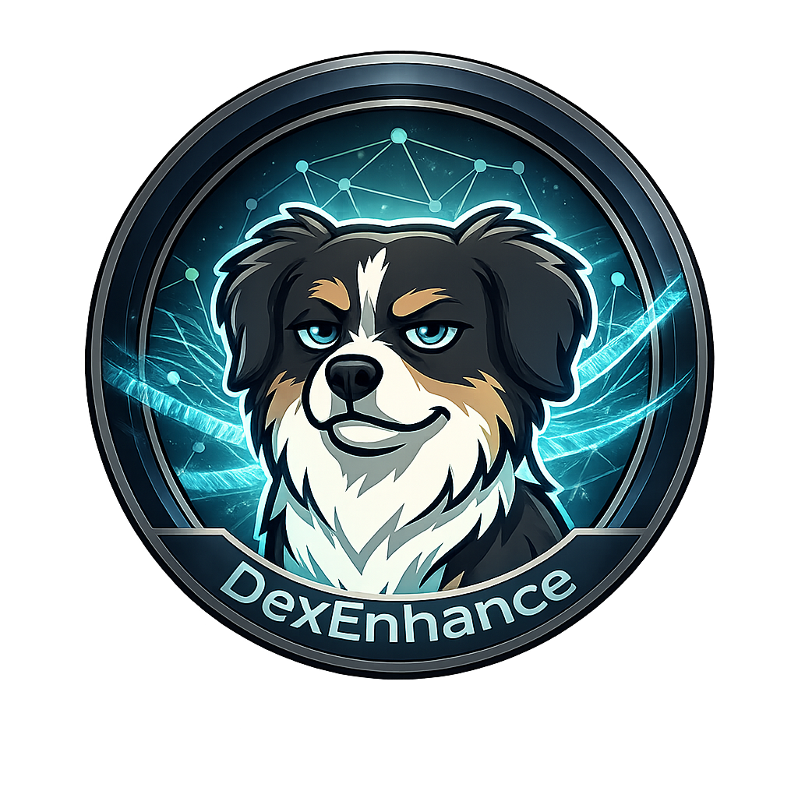

<div align="center">
  
</div>

<div align="center">


</div>

# DexEnhance

DexEnhance is a local-first, cross-site productivity extension for ChatGPT and Google Gemini.
It runs entirely client-side (Manifest V3), keeps state in `chrome.storage.local`, and avoids external runtime dependencies.

## Key Features

- **Cross-Site State:** Shared data model across ChatGPT and Gemini using a single service worker.
- **Folder Organization:** Virtual folder tree with assign, trash, restore, and permanent delete flows.
- **Smart Queue:** Queue follow-up prompts while generation is active, then auto-send in order.
- **Prompt Library:** Reusable templates with `{{variable}}` substitution.
- **Prompt Optimizer:** Deterministic local rewrite first, optional AI refinement mode.
- **Export Tools:** Conversation export to PDF and DOCX.
- **Token/Model Overlay:** API metadata relay with model + token visibility.
- **Guided UI:** Glassmorphic Shadow DOM UI with feature tour/onboarding.

## Supported Sites

- `https://chatgpt.com/*`
- `https://gemini.google.com/*`

## Architecture Snapshot

- **Manifest:** MV3
- **UI:** Preact + Shadow DOM
- **Build:** Bun + Vite (IIFE output for background/content bundles)
- **State:** `chrome.storage.local` via service worker message protocol
- **DOM Access:** Adapter pattern (`ChatInterface`) only

## Installation

### Option A: Build from Source (Recommended)

**Prerequisites:**
- Bun installed
- Brave (or any Chromium browser) for primary target testing
- Firefox for parallel target testing (optional)

**Quick Build (Brave/Chromium):**
```bash
cd /Users/andrew/Projects/DexEnhance
bun run build
```

**Load in Brave:**
1. Open `brave://extensions`
2. Enable **Developer mode**
3. Click **Load unpacked**
4. Select `/Users/andrew/Projects/DexEnhance/dist`

### Option B: Firefox Target (Parallel Build)

Generate Firefox-specific output alongside Chromium build:
```bash
cd /Users/andrew/Projects/DexEnhance
bun run build:firefox
```

Load in Firefox (temporary add-on):
1. Open `about:debugging#/runtime/this-firefox`
2. Click **Load Temporary Add-on...**
3. Select `/Users/andrew/Projects/DexEnhance/dist-firefox/manifest.json`

Note: Temporary add-ons are removed on Firefox restart.

## Packaging

### Chromium/Brave Zip
```bash
cd /Users/andrew/Projects/DexEnhance
bun run package:zip
```
Output:
- `/Users/andrew/Projects/DexEnhance/DexEnhance-v1-private.zip`

### Firefox Zip
```bash
cd /Users/andrew/Projects/DexEnhance
bun run package:zip:firefox
```
Output:
- `/Users/andrew/Projects/DexEnhance/DexEnhance-v1-firefox.zip`

## Verification

Run automated extension verification:
```bash
cd /Users/andrew/Projects/DexEnhance
bun run build
node scripts/verify_extension_playwright.cjs
```

Primary verification report:
- `/Users/andrew/Projects/DexEnhance/.planning/phases/phase-10/phase-10-05-playwright-verification.json`

## Development

Watch mode:
```bash
cd /Users/andrew/Projects/DexEnhance
bun run watch
```

Important: Vite commands must run as `bunx --bun vite` (already encoded in scripts).

## Security and Constraints

- Manifest V3 only
- No external CDN, remote fonts, or cross-origin runtime assets
- Background/content bundles built as IIFE
- Service worker listeners registered synchronously at top level
- All state mutations routed through service worker protocol
- DOM interactions handled through adapters (no raw feature-module selectors)

## Troubleshooting

If you run this in page DevTools and get:
`Cannot read properties of undefined (reading 'local')`

That is expected in page context. `chrome.storage` APIs are extension-context APIs and work from content scripts/service worker.

If UI does not update after rebuild:
1. Re-run `bun run build`
2. Reload extension in `brave://extensions`
3. Refresh target site tabs
